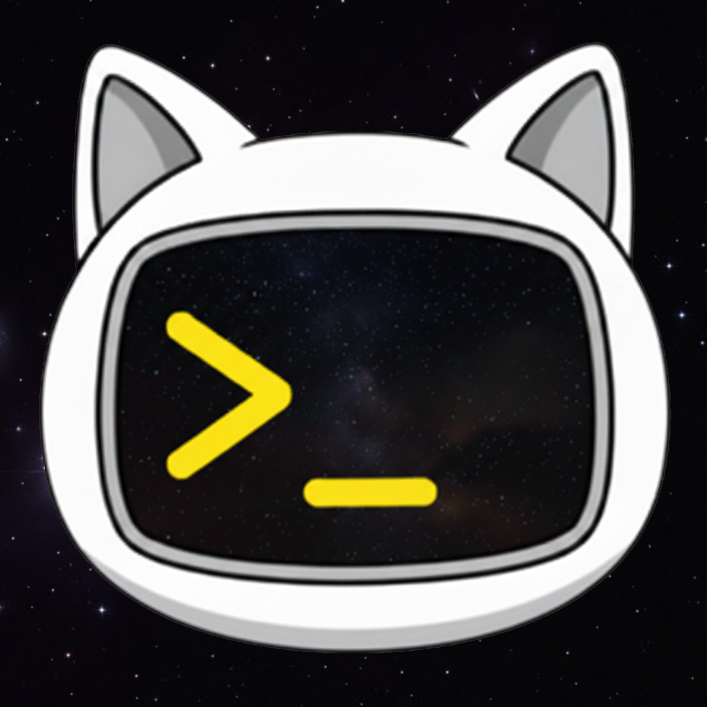

# CaTerm

macOS용 SSH/터미널 클라이언트

 

## 주요 기능

- **로컬 터미널** - 빠르고 가벼운 네이티브 터미널
- **SSH 연결** - 서버 연결 관리 및 저장
- **SFTP** - 파일 브라우저 및 전송
- **다중 탭/창** - 여러 세션 동시 작업
- **Markdown 뷰어** - 실시간 미리보기
- **다양한 테마** - Dark, Light, Dracula, Nord 등
- **자동 업데이트** - 새 버전 자동 알림

## 설치

[Releases](https://github.com/mgang4u-dev/CaTerm-releases/releases)에서 최신 DMG 파일을 다운로드하세요.

## 시스템 요구사항

- macOS 11.0 이상
- Apple Silicon (M1/M2/M3/M4)

## 기술 스택

- [Tauri 2.0](https://tauri.app/) - Rust 기반 데스크톱 앱 프레임워크
- [xterm.js](https://xtermjs.org/) - 웹 기반 터미널 에뮬레이터
- [SSH2](https://docs.rs/ssh2/) - Rust SSH 라이브러리

## 라이선스

MIT License
